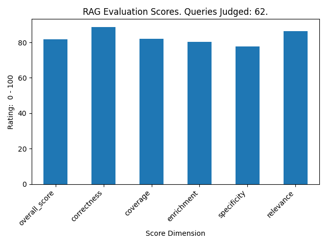

# Science Made Easy

**Science Made Easy**(SME) is a RAG project that makes advanced mathematical research accessible to people of any mathematical background.

Upon download, SME contains a document database focused on the much studied field of quasiperiodic Schrodinger equations in general and the family of the Almost Mathieu Operator in particular. Users can target any mathematical research domain for tailored exposition by rerunning the ETL to fetch an updated cache of resource documents.

## Summary

- Motivation
    - An end-to-end resource connecting students at any level to cutting edge mathematical and scientific research.
- ETL Pipeline
    - Papers sourced from ArXiv.com
    - Latex source parsed, chunked, and indexed for retrieval
    - Chunks are networked by adjacent text chunks as well as available cross references in the text 
    - Dual ETL pipelines for markdown math-aware evaluation and plain text based conceptual evaluation
- Query 
    - Both markdown and plain text are retrieved using multiple indexing methods and combined reciprocal rank fusion.
    - Finally the txt and md sources combined and reranked using cross encoding.
- Evaluation
    - Queries are generated based on a sample of text chunks.
    - The queries are fed into the normal RAG pipeline.
    - An LLM acts as a judge for the quality of the RAG responses vs the original text.


## Quick start

```
git clone <repo-url>
cd project
pip install -r requirements.txt
```

Rename example.env to .env and update OPENAI_API_KEY

```
streamlit run app.py
```

## Running the ETL

In order to rerun the ETL you will have to install Latexpand, Pandoc, and Detex.
Latexpand and Detex are included in texlive-extra-utils.

In run_etl.py update ```phrases`` and ```categories``` to target the domain of research desired.

```
sudo apt update

sudo apt install pandoc texlive-extra-utils

python run_etl.py
```

## Discussion

Many technical research papers are posted to ArXiv.com well in advance of publication. 
This is especially true for mathematical papers, where both pdf versions are available as well as source versions, which are almost universally in LaTex format.
Thus we use latex papers on ArXiv as our source. The multiple arxiv files (main, bibliography, etc) are collated into a single latex file.
This combined latex file is then processed and chunked. 
One branch is stripped of mathematical notation as a simplified plain text resource for conceptually oriented responses.
The second branch is enhanced to be mathematically aware and retains mathematical notation for better generation of mathematical details. 
Both branches are indexed using BM25 and Qdrant.  

On retrieval, the user query is used to generate a collection of references using both indexing methods on each branch. 
References on each branch are combined and ranked using RRF and the top k are selected. 
Finally both math aware and plain text references are combined and reranked using sentence_transformers.CrossEncoder and the top ranked are returned for responce generation. 

### Evaluation

The source data is unstructured, real-world text. 
Thus we do not naturally have question-and-answer-pairs or other text associated with the data.
Without gold standard questions to evaluate the retrieval and answer generation, we use an llm to generate queries from the chunked text,
see the notebook: [generate_queries](analysis/generate_queries.ipynb).

**Retrieval Evaluation** is demonstrated in notebook [evaluate_retrieval](analysis/evaluate_retrieval.ipynb).
- Hit Rate: 0.8065
- Mean Reciprocal Rank: 0.5173

**RAG Evaluation**
In order to evaluate, we use an ad-hoc LLM-as-judge method. 
First, text chunks are randomly selected from markdown and text sources respectively. 
Text chunks which are not suitable as sources for questions are discarded.
Queries relating to the texts are generated via LLM.
Generated queries are run by the RAG and those responses are compared to the original text. 
The LLM performs a structured evaluation based on several factors:

- Correctness (vs original)
- Coverage (vs original)
- Enrichment (beyond original)
- Specificity (meaningfulness and usefulness)
- Relevance (Does the RAG stay on topic)

Using these subjective parameters the LLM provides an impartial grading. 
The overall score is a weighted average of these metrics.



We can see the RAG does best on correctness and relevance, and performs lower on coverage, enrichment, and specificity. 
The lower coverage and specificity is likely because some questions allow for a variety of focus in response. 
On the other hand, as the sources are all mathematical papers it is unlikely that we would see any direct contradictions between sources.
